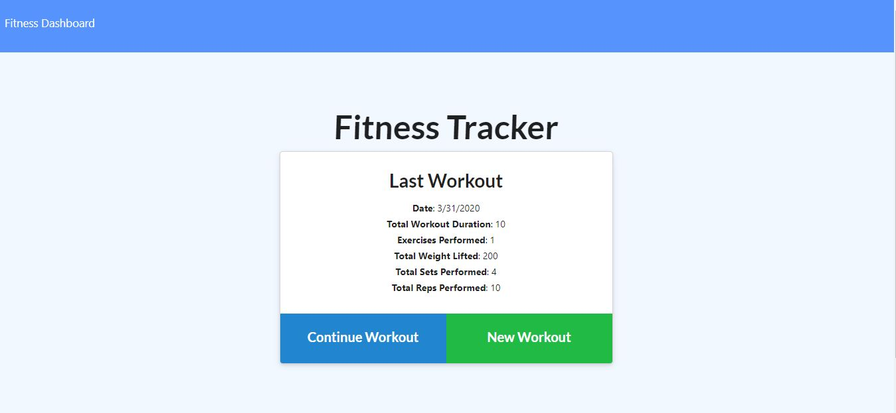

# Fitness Tracker

This application allows users to track their workouts so that they are more likely to acheive their fitness goals. It uses a Mongo database with a Mongoose schema and handles routes with Express.

For this assignment, we were provided with the frondend code (some of which was broken) and were required to write code to connect to a NoSQL database.  I created the model used in the database based on the provided seed file, then wrote code for the routes based off of the methods used in the frontend api.js file.

## Preview

## Usage

1. Clone the repo
2. Run `npm install` to install dependencies
3. Run `mongod`
4. Run `npm start`

When the user loads the page, they are given the option to create a new workout, or continue with their last workout.
The user is able to:

- Add exercises to a previous workout plan.
- Add new exercises to a new workout plan.
- View multiple the combined weight of multiple exercises on the stats page.

App intended functionality was slightly unclear, but it is working as intended (although not how I would design this app...)

## License

MIT License

Copyright (c) 2020 Jordyn Saltzman

Permission is hereby granted, free of charge, to any person obtaining a copy of this software and associated documentation files (the "Software"), to deal in the Software without restriction, including without limitation the rights to use, copy, modify, merge, publish, distribute, sublicense, and/or sell copies of the Software, and to permit persons to whom the Software is furnished to do so, subject to the following conditions: The above copyright notice and this permission notice shall be included in all copies or substantial portions of the Software. THE SOFTWARE IS PROVIDED "AS IS", WITHOUT WARRANTY OF ANY KIND, EXPRESS OR IMPLIED, INCLUDING BUT NOT LIMITED TO THE WARRANTIES OF MERCHANTABILITY, FITNESS FOR A PARTICULAR PURPOSE AND NONINFRINGEMENT. IN NO EVENT SHALL THE AUTHORS OR COPYRIGHT HOLDERS BE LIABLE FOR ANY CLAIM, DAMAGES OR OTHER LIABILITY, WHETHER IN AN ACTION OF CONTRACT, TORT OR OTHERWISE, ARISING FROM, OUT OF OR IN CONNECTION WITH THE SOFTWARE OR THE USE OR OTHER DEALINGS IN THE SOFTWARE.
